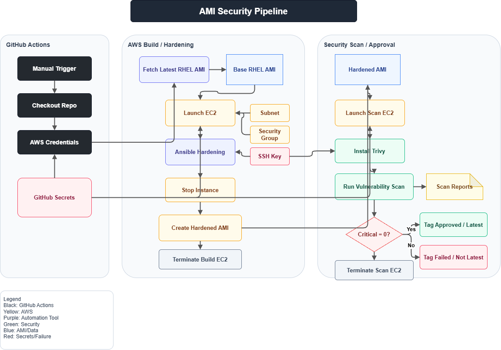

# AMI Security Pipeline

A comprehensive GitHub Actions workflow that automates the creation of hardened RHEL AMIs with built-in vulnerability scanning in AWS ap-south-1 region.

## Overview

This pipeline demonstrates enterprise-grade infrastructure as code (IaC) practices by automating the entire lifecycle of AMI creation:

- **Fetching** the latest RHEL base image from AWS
- **Hardening** the instance using Ansible playbooks with security best practices
- **Scanning** for vulnerabilities using Trivy container scanning tool
- **Tagging** and approving AMIs based on security assessment results

Perfect for infrastructure teams, DevOps engineers, and students learning CI/CD automation with AWS.

---

## Architecture Diagram



---

## Pipeline Jobs

### 1. **fetch-latest-ami**
Retrieves the most recent RHEL AMI available in the ap-south-1 region.

**Outputs:**
- `base_ami`: The AMI ID of the latest RHEL image

**Key Steps:**
- AWS credentials configuration
- Execute `fetch_ami.sh` script
- Parse JSON output and validate AMI ID

---

### 2. **harden-with-ansible**
Launches an EC2 instance and applies security hardening using Ansible.

**Inputs:**
- `base_ami` from fetch-latest-ami job

**Outputs:**
- `hardened_ami_id`: The newly created hardened AMI

**Key Steps:**
- Install Ansible and boto3
- Launch t3.medium instance with public IP
- Wait for SSH connectivity
- Execute Ansible hardening playbook
- Create AMI from the hardened instance
- Terminate the temporary instance

**Security Configurations Applied:**
- SSH key-based authentication
- Network security group rules
- Instance tagging for tracking

---

### 3. **vulnerability-scan**
Launches a new instance from the hardened AMI and scans it for vulnerabilities.

**Inputs:**
- `hardened_ami_id` from harden-with-ansible job

**Outputs:**
- `total_vulnerabilities`: Count of all vulnerabilities
- `critical_count`: Number of critical-severity issues
- `high_count`: Number of high-severity issues

**Key Steps:**
- Launch EC2 instance from hardened AMI
- Install Trivy via yum repository
- Run full filesystem vulnerability scan
- Generate JSON report with detailed findings
- Analyze results and determine pass/fail status
- Tag AMI based on scan outcome
- Terminate scan instance and clean up

**Trivy Scanning:**
- Detects vulnerabilities in system packages
- Outputs detailed JSON report
- Supports multiple severity levels (critical, high, medium, low)

---

## AMI Tagging Strategy

### Clean Scan (No Vulnerabilities)
```
hardened: true
security: passed
scan-status: clean
approved: true
latest: true
scanned-by: Trivy
scan-date: YYYY-MM-DD
```

### Vulnerabilities Found
```
hardened: true
security: failed
scan-status: vulnerable
approved: false
latest: false
vulnerability-count: <number>
critical-count: <number>
high-count: <number>
scanned-by: Trivy
scan-date: YYYY-MM-DD
```

---

## Prerequisites

### AWS Setup
- AWS account with appropriate IAM permissions
- EC2 key pair named `ami-hardening` created in ap-south-1
- Security group allowing inbound SSH (port 22)
- VPC and subnet IDs available

### Required AWS Permissions
```json
{
  "Version": "2012-10-17",
  "Statement": [
    {
      "Effect": "Allow",
      "Action": [
        "ec2:DescribeImages",
        "ec2:RunInstances",
        "ec2:StopInstances",
        "ec2:TerminateInstances",
        "ec2:WaitInstanceRunning",
        "ec2:WaitInstanceStopped",
        "ec2:CreateImage",
        "ec2:DescribeInstances",
        "ec2:CreateTags",
        "ec2:WaitImageAvailable"
      ],
      "Resource": "*"
    }
  ]
}
```

### Repository Structure
```
.
├── .github/
│   └── workflows/
│       └── ami-pipeline.yml          # Main GitHub Actions workflow
├── ansible/
│   ├── playbook.yml                  # Hardening playbook
│   ├── inventory.ini                 # (Generated at runtime)
│   └── roles/
│       └── ...                       # Ansible roles for hardening
├── scripts/
│   ├── fetch_ami.sh                  # Fetch latest RHEL AMI
│   ├── run_trivy_scan.py             # Execute Trivy scan
│   └── qualys_scan.py                # (Optional) Qualys integration
├── .env.example                      # Environment variables template
├── .gitignore
└── README.md
```

---

## Setup Instructions

### 1. Clone Repository
```bash
git clone https://github.com/your-org/ami-hardening.git
cd ami-hardening
```

### 2. Configure GitHub Secrets

Navigate to **Settings → Secrets and variables → Actions** and add:

| Secret | Description |
|--------|-------------|
| `AWS_ACCESS_KEY_ID` | AWS IAM user access key |
| `AWS_SECRET_ACCESS_KEY` | AWS IAM user secret key |
| `SSH_PRIVATE_KEY` | Private key content (from ami-hardening key pair) |
| `SECURITY_GROUP_ID` | Security group ID (sg-xxxxx) |
| `SUBNET_ID` | VPC subnet ID (subnet-xxxxx) |

### 3. Create SSH Key Pair
```bash
aws ec2 create-key-pair \
  --region ap-south-1 \
  --key-name ami-hardening \
  --query 'KeyMaterial' \
  --output text > ami-hardening.pem

chmod 600 ami-hardening.pem
```

### 4. Set AWS Credentials
```bash
export AWS_ACCESS_KEY_ID="your-access-key"
export AWS_SECRET_ACCESS_KEY="your-secret-key"
export AWS_REGION="ap-south-1"
```

### 5. Configure Ansible (Optional Local Testing)
```bash
pip install ansible boto3 botocore
ansible-galaxy collection install community.general amazon.aws
```

---

## Usage

### Trigger the Pipeline

#### Option 1: GitHub UI
1. Go to **Actions** → **AMI Security Pipeline - ap-south-1**
2. Click **Run workflow**
3. Choose branch and set `force_build` flag if needed
4. Click **Run workflow**

#### Option 2: GitHub CLI
```bash
gh workflow run ami-pipeline.yml -f force_build=false
```

#### Option 3: curl (with token)
```bash
curl -X POST \
  https://api.github.com/repos/YOUR-ORG/ami-hardening/actions/workflows/ami-pipeline.yml/dispatches \
  -H "Authorization: token $GITHUB_TOKEN" \
  -H "Accept: application/vnd.github.v3+json" \
  -d '{"ref":"main","inputs":{"force_build":"false"}}'
```

### Monitor Execution
1. Go to **Actions** tab in GitHub
2. Click on the running workflow
3. View real-time logs for each job
4. Check CloudWatch logs for detailed execution details

### Download Scan Results
1. Go to the completed workflow run
2. Scroll to **Artifacts** section
3. Download `trivy-reports-{run-id}.zip`
4. Extract and review `trivy_results.json`

---

## Customization

### Modify Hardening Steps
Edit `ansible/playbook.yml` to customize security configurations:
```yaml
- name: Configure security baselines
  hosts: ami_target
  become: yes
  tasks:
    - name: Install security packages
      yum:
        name:
          - aide
          - fail2ban
          - firewalld
        state: present
```

### Adjust Scan Thresholds
Modify the vulnerability assessment logic in the workflow:
```yaml
- name: Tag AMI based on scan result
  run: |
    if [ "$CRITICAL" -gt 0 ]; then
      echo "Critical vulnerabilities found"
      exit 1
    fi
```

### Add Additional Scans
Extend the `vulnerability-scan` job to include:
- Qualys scans
- Amazon Inspector integration
- CIS benchmark checks

---

## Troubleshooting

### SSH Connection Timeout
**Problem:** "SSH not ready" error after 30 attempts

**Solutions:**
- Verify security group allows inbound SSH (port 22)
- Check IAM role has `ec2:AuthorizeSecurityGroupIngress` permission
- Increase `sleep 90` before SSH wait loop
- Verify subnet has public IP assignment enabled

### AMI Fetch Fails
**Problem:** "Unable to fetch latest RHEL AMI"

**Solutions:**
```bash
# Verify RHEL images exist in ap-south-1
aws ec2 describe-images \
  --region ap-south-1 \
  --owners amazon \
  --filters "Name=name,Values=RHEL-*" \
  --query 'Images[0:5].[ImageId,Name]'
```

### Ansible Playbook Errors
**Problem:** Playbook fails with connection errors

**Solutions:**
- Test locally: `ansible-playbook -i inventory.ini playbook.yml -vvv`
- Verify EC2 user is `ec2-user` (not ubuntu)
- Check SSH key permissions: `chmod 600 private_key.pem`

### Trivy Scan Hangs
**Problem:** Trivy scan never completes

**Solutions:**
- Check disk space on instance: `ssh ... df -h`
- Increase timeout-minutes in workflow (currently 120)
- Run scan with progress: `trivy image --download-db-only`

### AMI Creation Fails
**Problem:** "Image creation failed" error

**Solutions:**
```bash
# Check instance stopped properly
aws ec2 describe-instances \
  --instance-ids <instance-id> \
  --query 'Reservations[0].Instances[0].State'

# Verify permissions for ec2:CreateImage
```

---

## Best Practices

### Security
- ✅ Store all secrets in GitHub Secrets, never hardcode
- ✅ Use IAM roles with least-privilege permissions
- ✅ Rotate SSH keys and access credentials regularly
- ✅ Enable CloudTrail for audit logging
- ✅ Review Trivy scan results before approving AMIs

### Cost Optimization
- ✅ Set appropriate artifact retention (currently 30 days)
- ✅ Terminate instances even on workflow failure
- ✅ Consider scheduled cleanup jobs for old AMIs

### Operational Excellence
- ✅ Review logs and reports after each run
- ✅ Test hardening playbook changes in dev environment first
- ✅ Keep Ansible and dependencies updated
- ✅ Document any custom hardening steps
- ✅ Use consistent naming conventions for AMIs

---

## Outputs and Artifacts

### GitHub Artifacts
- **trivy-reports-{run-id}**: Contains `trivy_results.json` with:
  - Total vulnerability count
  - Breakdown by severity (critical, high, medium, low)
  - Detailed findings with package information
  - Remediation recommendations

### AWS Artifacts
- **Hardened AMI**: Tagged and available in EC2 console
- **AMI Tags**: Metadata for filtering and selection
- **CloudWatch Logs**: Execution logs from EC2 instances

### Reports Location
```
reports/
├── latest_amis.json
├── trivy_results.json
└── scan-summary.txt
```

---

## Learning Outcomes

This project demonstrates:

1. **GitHub Actions**: Workflow orchestration, job dependencies, artifacts, secrets
2. **AWS EC2**: Instance lifecycle management, AMI creation, tagging strategies
3. **Ansible**: Configuration management, playbooks, inventory, remote execution
4. **Trivy**: Vulnerability scanning, JSON reporting, severity classification
5. **Shell Scripting**: AWS CLI usage, error handling, JSON parsing with jq
6. **Python**: Custom scanning scripts, API integration
7. **CI/CD Best Practices**: Automated testing, gating, approval workflows
8. **Infrastructure as Code**: Reproducible, version-controlled infrastructure

---

## Contributing

### Add a New Feature
1. Create feature branch: `git checkout -b feature/add-compliance-scan`
2. Make changes and test locally
3. Commit with clear messages: `git commit -m "Add CIS benchmark scan"`
4. Push and create Pull Request
5. Wait for workflow approval

### Report Issues
- Check existing issues first
- Provide AWS region, workflow logs, and error messages
- Include reproduction steps

---

## License

This project is licensed under the MIT License - see LICENSE file for details.

---

## Support & Resources

### Documentation
- [GitHub Actions Documentation](https://docs.github.com/en/actions)
- [AWS EC2 API Reference](https://docs.aws.amazon.com/ec2/)
- [Ansible Documentation](https://docs.ansible.com/)
- [Trivy Documentation](https://aquasecurity.github.io/trivy/)

### Related Tools
- **Amazon Inspector**: AWS-native vulnerability scanning
- **AWS Config**: Compliance monitoring
- **EC2 Image Builder**: Alternative AMI creation tool
- **Packer**: Infrastructure as code for AMI creation

### Community
- GitHub Issues for bug reports and feature requests
- Discussions for general questions
- Pull requests welcome for improvements

---

**Last Updated:** 2026-05-23
**Maintainer:** DevOps Team
**Status:** Active Development
